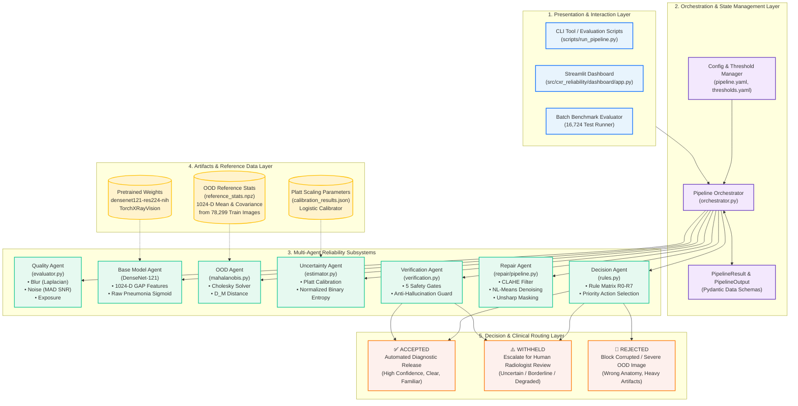

# 🏛️ SYSTEM BLOCK DIAGRAM
## Reliability-Aware Multi-Agent System for Chest X-Ray Pneumonia Classification

> **Purpose:** Structural architectural block diagram, component decomposition, hardware/software stack, and module interactions.

---

## 1. Complete System Architecture Block Diagram (Mermaid)



---

## 2. Text / ASCII Block Diagram

```text
========================================================================================
                          PRESENTATION & CLIENT LAYER
      [ Streamlit Dashboard ]   [ CLI Scripts ]   [ Pytest Test Suite (448 Tests) ]
===========================================┬============================================
                                           │ Request / Image File
                                           ▼
========================================================================================
                         PIPELINE ORCHESTRATOR LAYER
      • Central State Coordinator (`ReliabilityPipeline`)
      • Configuration & Threshold Injector (`pipeline.yaml`, `thresholds.yaml`)
      • Immutable Pydantic Schemas (`PipelineResult`, `PipelineOutput`)
===========================================┬============================================
                                           │
    ┌────────────────┬─────────────────────┼─────────────────────┬──────────────────┐
    ▼                ▼                     ▼                     ▼                  ▼
┌──────────────┐ ┌───────────────┐ ┌───────────────┐ ┌────────────────┐ ┌───────────────┐
│ QUALITY      │ │ BASE MODEL    │ │ UNCERTAINTY   │ │ OOD DETECTOR   │ │ DECISION      │
│ EVALUATOR    │ │ (DenseNet-121)│ │ ESTIMATOR     │ │ (Mahalanobis)  │ │ RULE ENGINE   │
├──────────────┤ ├───────────────┤ ├───────────────┤ ├────────────────┤ ├───────────────┤
│ • Laplacian  │ │ • 1024-D GAP  │ │ • Platt Calib │ │ • 78k Dataset  │ │ • Rules R0-R7 │
│   Blur Var   │ │   Features    │ │ • Conf = max  │ │   Statistics   │ │ • Priority    │
│ • MAD SNR    │ │ • Pneumonia   │ │ • Binary      │ │ • Regularized  │ │   Resolution  │
│ • Exposure   │ │   Sigmoid     │ │   Entropy     │ │   Cholesky     │ │ • Action:     │
│   Bounds     │ │   Head (Idx 8)│ │ • Thresholds  │ │ • D_M Metric   │ │   Acc/Esc/Rej │
└──────────────┘ └───────────────┘ └───────────────┘ └────────────────┘ └───────┬───────┘
                                                                                │
                                           ┌────────────────────────────────────┘
                                           │ IF Action == REPAIR
                                           ▼
========================================================================================
                       REPAIR & VERIFICATION SAFETY LOOP
┌──────────────────────────────────────────────────┐ ┌──────────────────────────────────┐
│ REPAIR AGENT                                     │ │ VERIFICATION AGENT               │
├──────────────────────────────────────────────────┤ ├──────────────────────────────────┤
│ 1. CLAHE (Local Contrast & Exposure Normalizer)  │ │ Gate 1: Repair was applied       │
│ 2. NL-Means (High-Fidelity Edge-Safe Denoising)  │ │ Gate 2: No label flip (p <=> 0.5)│
│ 3. Unsharp Masking (Frequency Edge Sharpening)   │ │ Gate 3: OOD remains IN-DIST      │
│                                                  │ │ Gate 4: Quality improves to GOOD │
│ Output: Non-destructive in-memory image tensor   │ │ Gate 5: Delta Conf & SNR guards  │
└──────────────────────────────────────────────────┘ └─────────────────┬────────────────┘
                                                                       │
=======================================================================╪================
                         CLINICAL ROUTING OUTPUTS                      │
                                                                       ▼
  [ ✅ RELEASE PREDICTION ]             [ ⚠️ WITHHOLD: ESCALATE ]     [ 🛑 REJECT ]
  • Direct Accept (R6)                  • Uncertain Model (R4)         • Severe OOD (R1)
  • Verified Repaired (Gate 1-5 Passed) • Borderline OOD (R2)          • Corrupted (R0)
  • Acc: 92.31%, NPV: 99.02%            • Unverified Repair (Gate Fail)
========================================================================================
```

---

## 3. Layer-by-Layer Architectural Breakdown

### Layer 1: Presentation & Client Interface
- **Streamlit Web UI (`app.py`):** Interactive frontend allowing radiologists/evaluators to upload an X-ray, inspect real-time agent dials, view before/after repair image overlays, and inspect gate audits.
- **Batch Evaluation Harness:** Evaluates massive datasets (e.g., 16,724 images across 8 hours) with zero memory leaks.
- **Pytest Suite:** 448 unit/integration tests confirming deterministic behavior and schema invariants.

### Layer 2: Orchestration & State Management
- **Pipeline Orchestrator:** Implements the Facade and Chain of Responsibility patterns, executing agents in sequence and passing state through `PipelineContext`.
- **Pydantic Data Contracts:** Guarantees strict type-safety and non-negotiable invariant:
  $$\text{prediction is None} \iff \text{needs\_human\_review is True}$$

### Layer 3: Multi-Agent Specialist Layer
- **Decoupled Responsibilities:** Each agent performs exactly one mathematical or domain check.
- **No Shared State:** Agents operate on pure data passed via input arguments, preventing race conditions or cross-contamination.

### Layer 4: Storage & Reference Artifacts
- **`reference_stats.npz` (20 MB):** Precomputed mean vector $\mu \in \mathbb{R}^{1024}$ and regularized covariance matrix $\Sigma \in \mathbb{R}^{1024 \times 1024}$ computed across 78,299 patient-strict training chest X-rays.
- **`densenet121-res224-nih`:** Pretrained weights from the TorchXRayVision library.
- **`calibration_results.json`:** Platt scaling parameters trained on 17,097 validation cases.

### Layer 5: Clinical Routing Layer
- **Three Safe Exits:**
  1. **RELEASED:** Safe for automated review (Acc = 92.31%, Specificity = 93.15%, NPV = 99.02%).
  2. **ESCALATE:** Prediction withheld; routed to human radiologist workstation with full audit trace.
  3. **REJECT:** Prediction withheld; notification sent to technician that image is invalid or severely out-of-distribution.

---

## 4. Software Stack & Dependencies

| Component | Library / Framework | Version / Role |
|---|---|---|
| Deep Learning Core | `torch`, `torchvision` | Model loading, tensor operations |
| Medical Imaging | `torchxrayvision` | Pretrained DenseNet-121 weights |
| Image Processing | `opencv-python` (`cv2`) | Laplacian, CLAHE, NL-Means, Unsharp Mask |
| Scientific Computing | `numpy`, `scipy` | Cholesky factorization, MAD estimator |
| Calibration | `scikit-learn` | Platt Logistic Regression calibrator |
| Data Validation | `pydantic` | Pipeline state models & invariant enforcement |
| Presentation UI | `streamlit` | Interactive multi-agent dashboard |
| Configuration | `pyyaml` | Centralized pipeline & threshold parameters |
| Testing | `pytest` | 448 automated unit and integration tests |

---

## 5. Viva Talking Points on Architecture
- **Why Multi-Agent over Monolithic Model?**  
  A monolithic end-to-end model is a black box. If it gives a wrong prediction, you cannot pinpoint why. In our multi-agent architecture, failures are transparent: we know if it was rejected due to blur (Quality Agent), alien anatomy (OOD Agent), or model hesitation (Uncertainty Agent).
- **Extensibility:**  
  New agents (e.g., Patient Demographics Agent, DICOM Metadata Agent) can be plugged in without refactoring existing classifier code.
- **Safety by Construction:**  
  The verification loop creates an anti-hallucination boundary: even if an image is repaired, the prediction is never released unless verified against all 5 safety gates.
