# 🔄 SYSTEM FLOWCHART
## Reliability-Aware Multi-Agent System for Chest X-Ray Pneumonia Classification

> **Purpose:** Detailed end-to-end processing pipeline flowchart, decision logic, repair loops, and verification gates.

---

## 1. High-Level Pipeline Flowchart (Mermaid)

```mermaid
flowchart TD
    Start([Input: Chest X-Ray Image]) --> Stage1[Stage 1: Quality Evaluation]
    
    %% Quality Assessment
    Stage1 --> Q_Blur{Blur < 100?}
    Stage1 --> Q_Noise{SNR < 15 dB?}
    Stage1 --> Q_Exp{Exposure < 20 or > 235?}
    
    Q_Blur & Q_Noise & Q_Exp --> Q_State[Determine Quality State: GOOD / DEGRADED / POOR]
    
    %% Base Model & Feature Extraction
    Q_State --> Stage2[Stage 2: DenseNet-121 Feature Extraction & Inference]
    Stage2 --> Feat[1024-D Feature Vector z]
    Stage2 --> RawPred[Raw Sigmoid Pneumonia Output p]
    
    %% Calibration & Uncertainty
    RawPred --> Calib[Platt Scaling Calibration]
    Calib --> CalibP[Calibrated Probability p_calib]
    CalibP --> Stage3[Stage 3: Uncertainty Estimation]
    Stage3 --> Conf[Confidence = max p, 1-p]
    Stage3 --> Entropy[Normalized Entropy H_norm]
    Conf & Entropy --> UncState{Confidence >= 0.85 & H_norm <= 0.25?}
    UncState -- Yes --> UncLow[Uncertainty: LOW]
    UncState -- No --> UncHigh[Uncertainty: HIGH]
    
    %% OOD Detection
    Feat --> Stage4[Stage 4: Mahalanobis OOD Detector]
    Stage4 --> CalcD[Calculate D_M with Cholesky on 78k Train Stats]
    CalcD --> OODState{Check D_M Thresholds}
    OODState -- D_M < 42.19 --> OOD_In[IN_DISTRIBUTION]
    OODState -- 42.19 <= D_M < 45.31 --> OOD_Border[BORDERLINE]
    OODState -- D_M >= 45.31 --> OOD_Severe[SEVERE OOD]
    
    %% Decision Agent (Rules R0-R7)
    Q_State & UncLow & UncHigh & OOD_In & OOD_Border & OOD_Severe --> Stage5[Stage 5: Decision Agent Rule Engine]
    
    Stage5 --> R1{Rule R1: OOD == SEVERE?}
    R1 -- Yes --> Act_Reject[Action: REJECT]
    
    R1 -- No --> R2{Rule R2: OOD == BORDERLINE?}
    R2 -- Yes --> Act_Escalate[Action: ESCALATE]
    
    R2 -- No --> R3{Rule R3: Quality POOR/DEGRADED & OOD In-Dist?}
    R3 -- Yes --> CheckRepairCount{Repair Attempt <= Max 1?}
    
    CheckRepairCount -- Yes --> Stage6[Stage 6: Image Repair Pipeline]
    CheckRepairCount -- No --> Act_Escalate
    
    R3 -- No --> R4{Rule R4: Quality GOOD & Uncertainty HIGH?}
    R4 -- Yes --> Act_Escalate
    
    R4 -- No --> R6{Rule R6: Quality GOOD & Uncertainty LOW?}
    R6 -- Yes --> Act_Accept[Action: ACCEPT]
    
    R6 -- No --> Act_Escalate
    
    %% Repair & Verification Loop
    Stage6 --> CLAHE[1. CLAHE Contrast Adjustment]
    CLAHE --> NLM[2. Non-Local Means Denoising]
    NLM --> Unsharp[3. Unsharp Mask Sharpening]
    Unsharp --> RepairedImg[Generate Repaired Image I_repaired]
    
    RepairedImg --> Stage7[Stage 7: 5-Gate Verification Agent]
    Stage7 --> Gate1{Gate 1: Repair was applied?}
    Gate1 -- Pass --> Gate2{Gate 2: No label flip across 0.5?}
    Gate2 -- Pass --> Gate3{Gate 3: OOD stayed IN_DISTRIBUTION?}
    Gate3 -- Pass --> Gate4{Gate 4: New Quality is GOOD?}
    Gate4 -- Pass --> Gate5{Gate 5: Delta Conf >= -0.01 & Delta SNR >= -5dB?}
    
    Gate1 & Gate2 & Gate3 & Gate4 & Gate5 -- Any Fail --> Act_Escalate
    Gate5 -- All Pass --> Act_AcceptRepair[Action: ACCEPT AFTER REPAIR]
    
    %% Terminal Pipeline Outputs
    Act_Accept --> Release[OUTPUT: RELEASED TO CLINICIAN]
    Act_AcceptRepair --> Release
    Act_Escalate --> Withhold[OUTPUT: WITHHELD - Doctor Review Needed]
    Act_Reject --> Withhold
    
    Release --> EndNode([Finish: Safe Prediction])
    Withhold --> EndNode
    
    %% Styling
    classDef acceptStyle fill:#d4edda,stroke:#28a745,stroke-width:2px,color:#155724;
    classDef escalateStyle fill:#fff3cd,stroke:#ffc107,stroke-width:2px,color:#856404;
    classDef rejectStyle fill:#f8d7da,stroke:#dc3545,stroke-width:2px,color:#721c24;
    classDef agentStyle fill:#e2e3e5,stroke:#383d41,stroke-width:1px,color:#1b1e21;
    
    class Act_Accept,Act_AcceptRepair,Release acceptStyle;
    class Act_Escalate,Withhold escalateStyle;
    class Act_Reject rejectStyle;
    class Stage1,Stage2,Stage3,Stage4,Stage5,Stage6,Stage7 agentStyle;
```



---

## 2. Text / ASCII Step-by-Step Flowchart

```text
[Input Chest X-Ray: I]
        │
        ▼
[1. Quality Agent] ──── Evaluates: Blur, Noise (SNR), Exposure Mean
        │
        ├── Quality State: (GOOD, DEGRADED, POOR)
        │
        ▼
[2. Base Classifier: DenseNet-121]
        │
        ├── Extracts: 1024-D Feature Vector z
        └── Predicts: Raw Probability p (TorchXRayVision Index 8: Pneumonia)
        │
        ▼
[3. Platt Calibration & Uncertainty Agent]
        │
        ├── Calibrated Probability: p_calib
        ├── Confidence: max(p, 1 - p)
        ├── Normalized Entropy: H_norm = -[p*ln(p) + (1-p)*ln(1-p)] / ln(2)
        └── Uncertainty State: LOW (if Conf >= 0.85 & H_norm <= 0.25) else HIGH
        │
        ▼
[4. OOD Detector (Mahalanobis Distance)]
        │
        ├── Computes: D_M = sqrt((z - μ)ᵀ · Σ⁻¹ · (z - μ)) using Cholesky
        └── OOD State:
              • IN_DISTRIBUTION (D_M < 42.19)
              • BORDERLINE      (42.19 <= D_M < 45.31)
              • SEVERE OOD      (D_M >= 45.31)
        │
        ▼
[5. Decision Agent: Rules Engine]
        │
        ├── Rule R1: OOD == SEVERE                 ──► [REJECT]   (Withhold)
        ├── Rule R2: OOD == BORDERLINE             ──► [ESCALATE] (Withhold)
        ├── Rule R3: Quality != GOOD & OOD In-Dist ──► [REPAIR]   ──┐
        ├── Rule R4: Quality GOOD & Unc == HIGH    ──► [ESCALATE] (Withhold)
        ├── Rule R6: Quality GOOD & Unc == LOW     ──► [ACCEPT]   ──┼► (RELEASED)
        └── Rule R7: Fallback Default              ──► [ESCALATE] (Withhold)
                                                                    │
      ┌─────────────────────────────────────────────────────────────┘
      ▼
[6. Repair Agent] (Attempt 1 of 1)
      │
      ├── 1. CLAHE (Contrast Limiting Adaptive Histogram Equalization)
      ├── 2. Non-Local Means (Denoising)
      └── 3. Unsharp Masking (Edge Sharpening)
      │
      ▼
[7. Verification Agent] (5 Strict Safety Gates)
      │
      ├── Gate 1: Repair was successfully executed
      ├── Gate 2: No label flip (Prediction stays on same side of 0.5)
      ├── Gate 3: OOD remains IN_DISTRIBUTION
      ├── Gate 4: Repaired Quality resolves strictly to GOOD
      └── Gate 5: Delta Confidence >= -0.01 AND Delta SNR >= -5 dB
      │
      ├── ALL GATES PASS?
            ├── YES ──► [ACCEPT AFTER REPAIR] ──► (RELEASED PREDICTION)
            └── NO  ──► [ESCALATE]            ──► (WITHHELD FOR DOCTOR)
```

---

## 3. Decision Matrix & Routing Table

| Rule | Input Quality | OOD State | Uncertainty | Resulting Action | Output Fate |
|:---:|:---:|:---:|:---:|:---:|:---:|
| **R0** | Invalid/Corrupt | Any | Any | **ESCALATE** | Withheld |
| **R1** | Any | **SEVERE (≥45.31)** | Any | **REJECT** | Withheld (Hard Stop) |
| **R2** | Any | **BORDERLINE (42.19–45.31)** | Any | **ESCALATE** | Withheld |
| **R3** | **POOR / DEGRADED** | IN_DISTRIBUTION | Any | **REPAIR** | Enters Repair Loop |
| **R4** | GOOD | IN_DISTRIBUTION | **HIGH** | **ESCALATE** | Withheld |
| **R6** | GOOD | IN_DISTRIBUTION | **LOW** | **ACCEPT** | **Released (Direct)** |
| **R7** | Any unmapped state | Any | Any | **ESCALATE** | Withheld (Safe Default) |

---

## 4. Key Takeaways for Viva
1. **Never Fails Silently:** Every unexpected or corrupt state triggers Rule R7 / R0 (`ESCALATE`), guaranteeing patient safety.
2. **Double Verification:** Repaired images are never trusted automatically; they must re-run through the entire pipeline and pass all 5 verification gates.
3. **Pydantic Data Invariant:** If `prediction == None`, then `needs_human_review == True` is strictly enforced in the data model.
